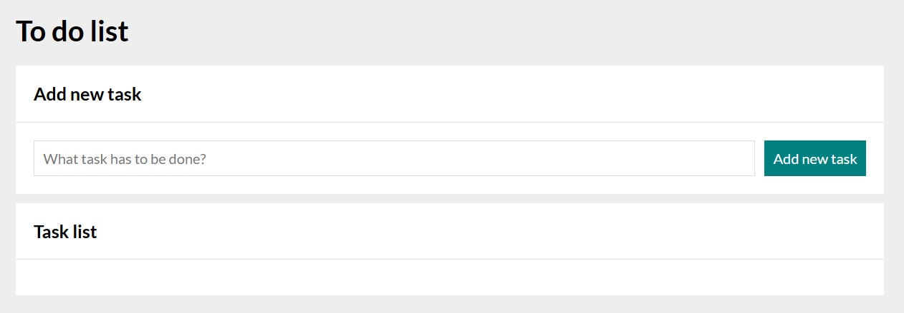
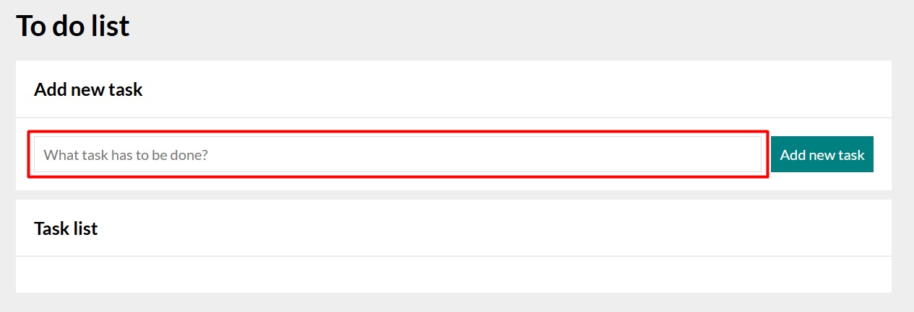
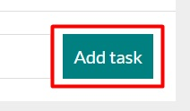
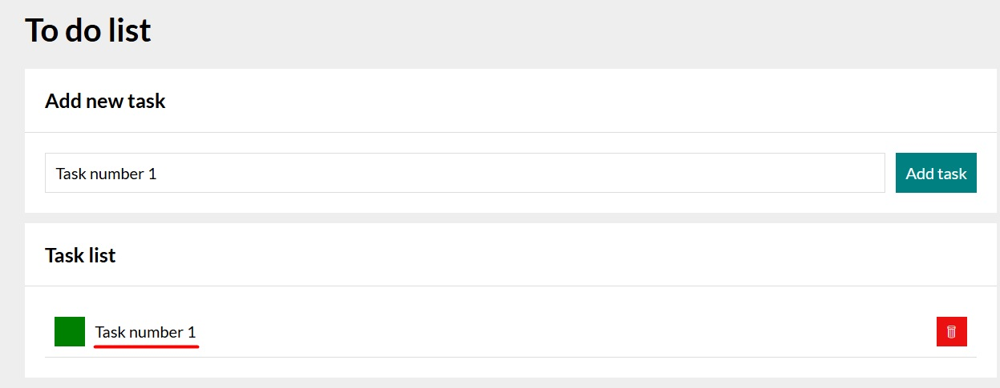
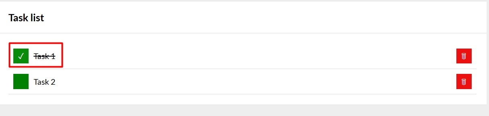
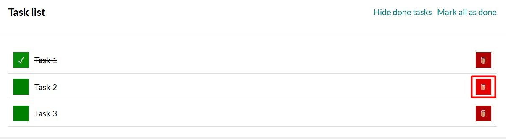
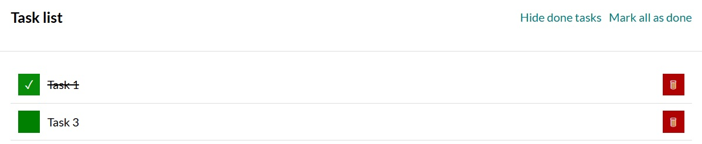
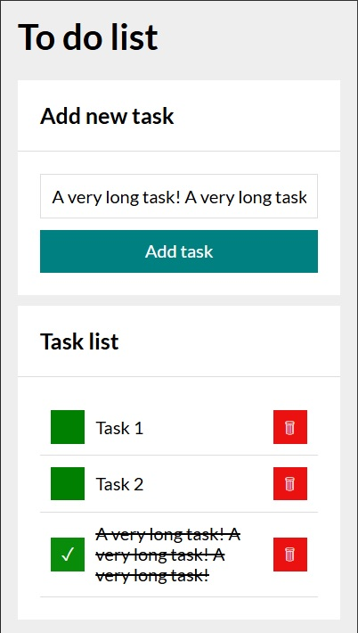

# To do list

## Description
Simple web application that allows users to create **To do list** with options to add new tasks, mark completed tasks as done or delete tasks

## Live demo

[View live demo - To do list](https://patkolino.github.io/ToDoList/)

## Usage
1. Within input field, enter the task You want to complete (or have completed but forgot to write it down initially) 

 

2. Click "Add task" button or simply press "Enter" key on keyboard 

 

3. Task is added to the Task list 

 

4. Once a task is added, You can mark it as completed or delete it

5. By clicking the green button on the left side, task is marked as done. A checkmark will appear within the green button and the task will be crossed over 

6. By clicking red button with thrash bin icon on the right side, task will be deleted 
 
 

## Additional information
- Webpage was built using **HTML**, **CSS** and **JavaScript**
- Normalize CSS included (https://cdnjs.com/libraries/normalize) 
- Code written according to BEM standards
- Grid layout model was used
- Page icon was added
- Additional styles are added to buttons in various states, in order to provide better visual representation for user
- @media at-rule was placed so that application is properly and correctly displayed on lower resolution 

- Added focus to the input field, allowing quicker, easier and more intuitive application usage