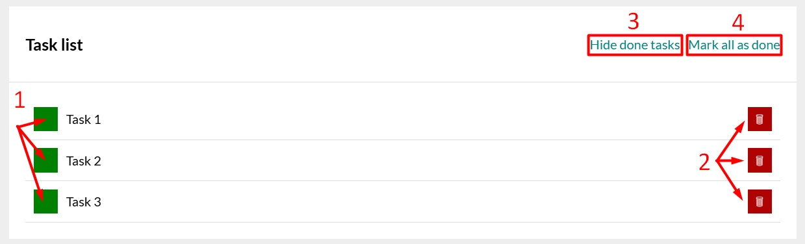
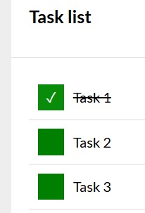
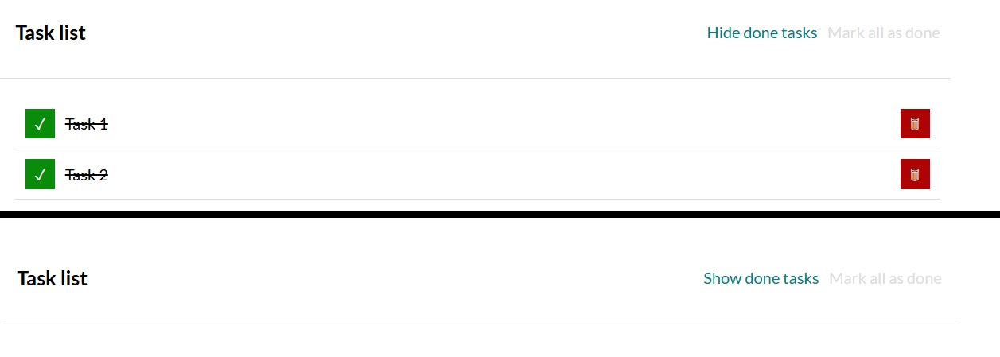
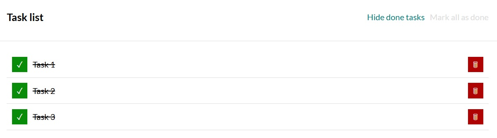
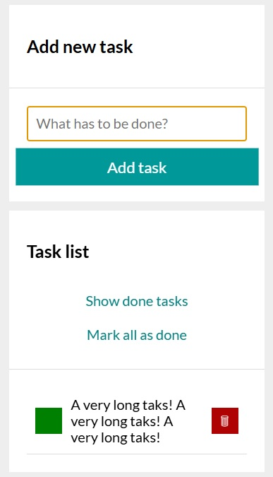

# To do list

## Description
Simple web application that allows users to create **To do list** with options to add new tasks, mark completed tasks as done or delete tasks

## Live demo

[View live demo - To do list](https://patkolino.github.io/ToDoListRefactored/)

## Usage
1. Within input field, enter the task You want to complete (or have completed but forgot to write it down initially) 

 

2. Click "Add task" button or simply press "Enter" key on keyboard 

 

3. Task is added to the Task list 

 

4. Once a task is added, there are 4 buttons available : 

  

<ol>
<li>

  Mark task as done - By clicking the green button on the left side, task is marked as done. A checkmark will appear within the green button and the task will be crossed over 

 </li>
 <li>

  Delete task - By clicking red button with thrash bin icon on the right side, task will be deleted 
 
 

</li>
<li>

  Hide done tasks - clicking this button will toggle between Hide done tasks and Show done tasks 

    

</li>
<li>

  Mark all tasks as done - Clicking on this button will mark all tasks as completed 

</li>

</ol>

Hide done tasks and Mark all as done buttons are not visible in case there are no tasks in the task list. In case all tasks are marked as completed, the Mark all as done button will not be clickable as visible on the screenshot above.

## Additional information
- Webpage was built using **HTML**, **CSS** and **JavaScript**
- Normalize CSS included (https://cdnjs.com/libraries/normalize) 
- Code written according to BEM standards
- Grid layout model was used
- Page icon was added
- JS code was refactored from previous app version, immutability applied
- Additional styles are added to buttons in various states, in order to provide better visual representation for user - buttons also have transform option added
- @media at-rule was placed so that application is properly and correctly displayed on lower resolution 

- Added focus to the input field, allowing quicker, easier and more intuitive application usage